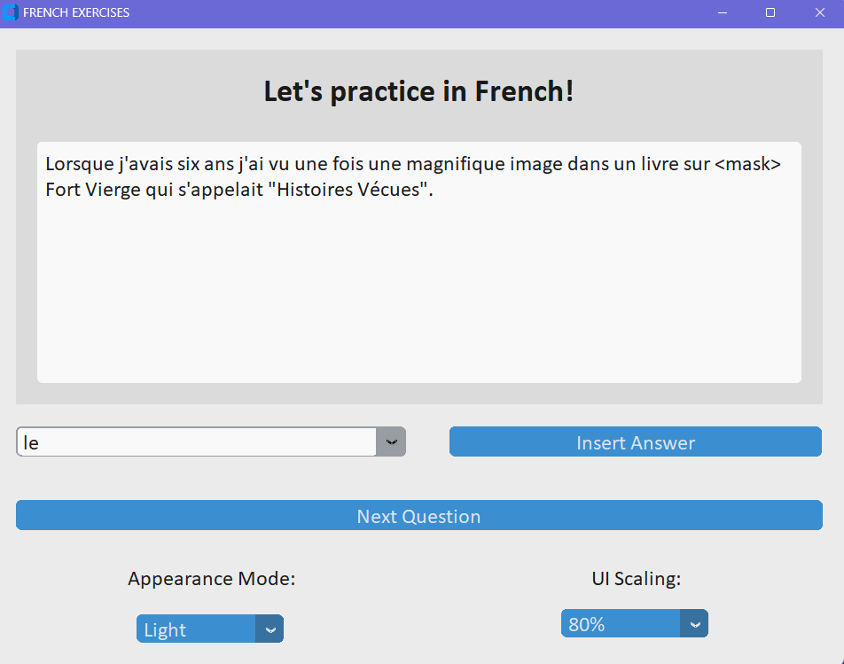

# Let's practice in French! :red_circle: :white_circle: :large_blue_circle:
This is a simple app to do practice in french language, based on a pretrained [model](#art-model-description) for the [fill-mask task](#dart-fill-mask-task).

### Table of Contents
- [Installation](#inbox_tray-installation)
- [Usage](#rocket-usage)
- [Idea](#bulb-idea)
  - [Features and Technologies](#-features-and-technologies)
  - [Fill-mask task](#dart-fill-mask-task)
  - [Model description](#art-model-description)
- [Contact](#incoming_envelope-contact)

## :inbox_tray: Installation

- [ ] _**to be done asap**_

## :rocket: Usage
  
| _Example of the FRENCH EXERCISES APP on Windows 11 with light mode and 'blue' theme_

https://user-images.githubusercontent.com/48122795/216835190-128ab6ec-07a9-4d6b-9765-fbbe6d7280ff.mp4  

| _Video example of how to do practice with FRENCH EXERCISES app! 🎈 _

## :bulb: Idea
The idea behind this project is to exploit existing pretrained model on [fill-mask task](#dart-fill-mask-task) in order to learn better a language.  
In particular, given a text or even better a bunch of text, it's possible collect a set of sentences to create a _Complete the sentence with the missing word_ test.  
Indeed, for each sentence it's possible to mask randomly a word and offer to the user a list of possible words/answers. One of them is the right one, the remaining are the most possible returned by a specific pretrained [model](#art-model-description) on french language. 

### ✨ Features and Technologies
---
The relevant features exploited in this projects are:
* Package configuration with `pyproject.toml` built with `hatch`
* Code formatting and linting with `ruff`, and `black`
* `pre-commit` configuration file
* CI-CD Pipelines with GitHub Actions
* Basic `pytest` set-up for unit tests
* Auto-generated docs with `mkdocs` and `mkdocs-material`
* [mBARThez](https://huggingface.co/moussaKam/mbarthez) as pretrained model for the fill-mask task
* [CustomTkinter](https://github.com/TomSchimansky/CustomTkinter) as a python UI-library based on Tkinter

### :dart: Fill-Mask task
---
Masked language modeling is the task of masking some of the words in a sentence and predicting which words should replace those masks.  
I decided to exploit a model trained for this kind of task, in particular for the french language.   

In the next section, the exploited model is described more in detail, i.e. [mBARThez](https://huggingface.co/moussaKam/mbarthez)

### :art: Model description
---
The **mBARThez** model is a child of BART, which is a transformer encoder-decoder (seq2seq) model with a bidirectional (BERT-like) encoder and an autoregressive (GPT-like) decoder. BART is pre-trained by corrupting text with an arbitrary noising function, and learning a model to reconstruct the original text.   
BARThez is pretrained by learning to reconstruct a corrupted input sentence. A corpus of 66GB of french raw text is used to carry out the pretraining.
Both its encoder and its decoder are pretrained.   
Moreover, in addition to BARThez, that is pretrained from scratch, the multilingual BART, mBART, is continuously pretrained which boosted its performance in both discriminative and generative tasks. The french adapted version is called mBARThez and it's the one exploited in this project.

For more detail on the model, check the following sources: [paper](https://arxiv.org/abs/2010.12321) and [github](https://github.com/moussaKam/BARThez).   

## :incoming_envelope: Contact
Author: Giulia Gualtieri    
Email: giulia.gualtieri@mail.polimi.it   

About me: Data Scientist :microscope: with strong passion for Machine Learning :computer: and Artificial Intelligence :thought_balloon: applications.  
As you can read, I'm also passionate about french language and culture.   
Language speaken: English, Italian, French. 

